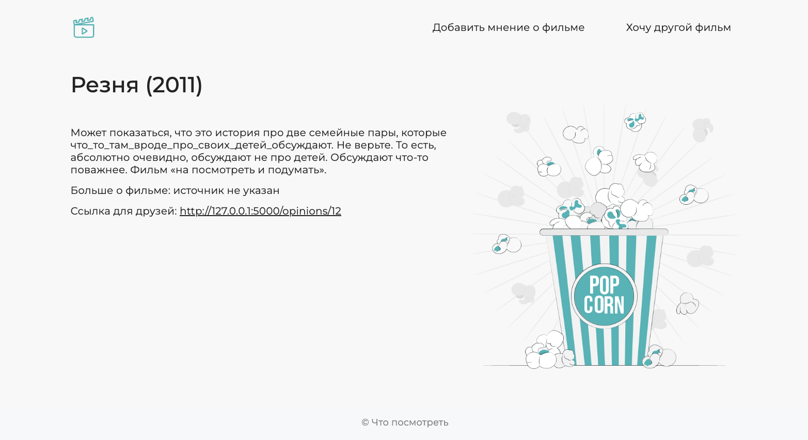
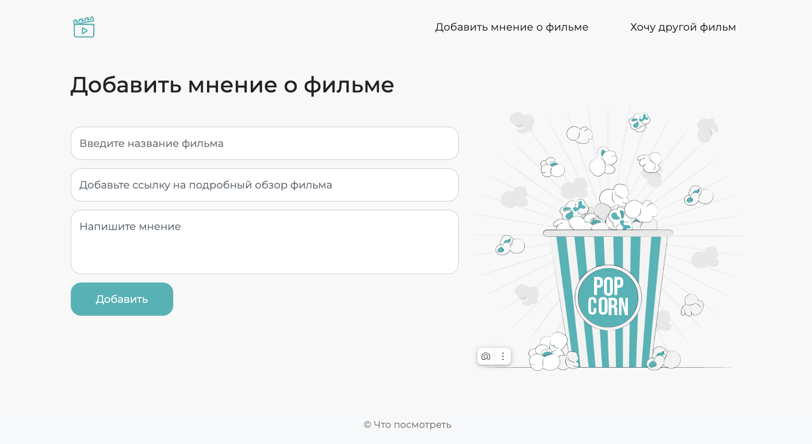
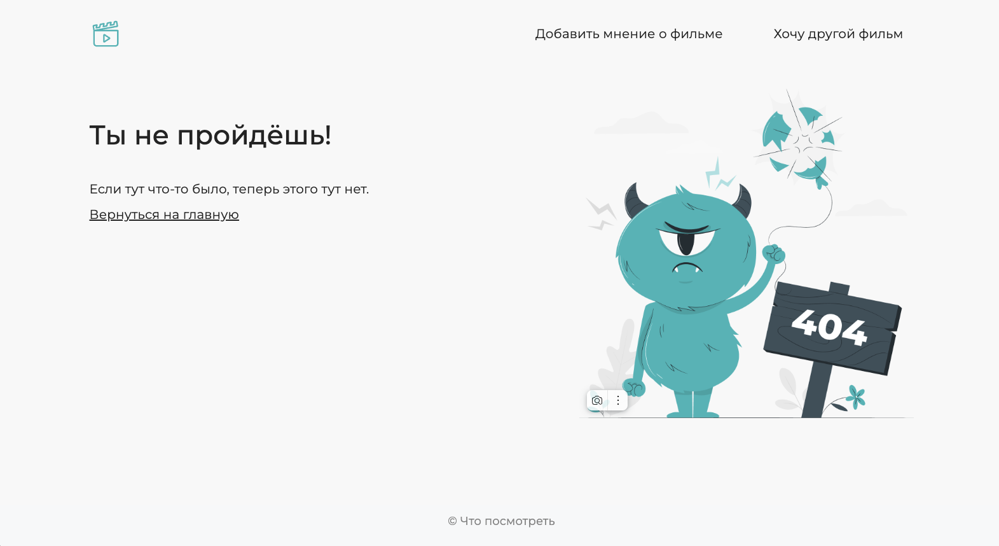

### Как запустить проект:

Клонировать репозиторий и перейти в него в командной строке:

```
git clone 
```

```
cd what_to_watch
```

Cоздать и активировать виртуальное окружение:

```
python3 -m venv venv
```

```
source venv/bin/activate
```
или для пользователей Windows

```
source env/Scripts/activate
```

Установить зависимости из файла requirements.txt:

```
python3 -m pip install --upgrade pip
```

```
pip install -r requirements.txt
```

Запустить проект:

```
flask run
```



